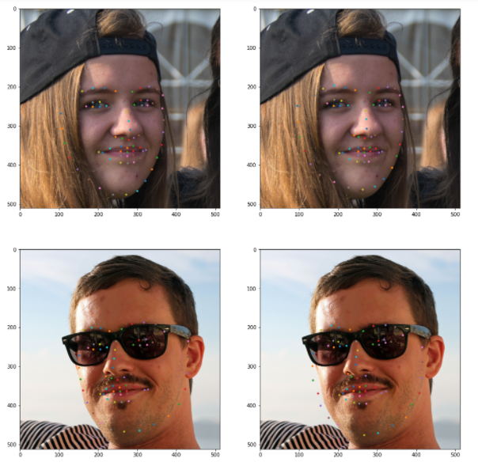

<h1>Facial Keypoints Detection:</h1>

	Detects 68 Landmarks on a face. This technique can be further used for <strong>Facial Expression Recognition</strong>, <strong>detecting dysmorphic facial signs for medical diagnosis</strong>.

	You can find the data <a href="https://www.kaggle.com/prashantarorat/facial-key-point-data">here</a>.

<h3>Here is sample image to show the performance of the model.</h3>
